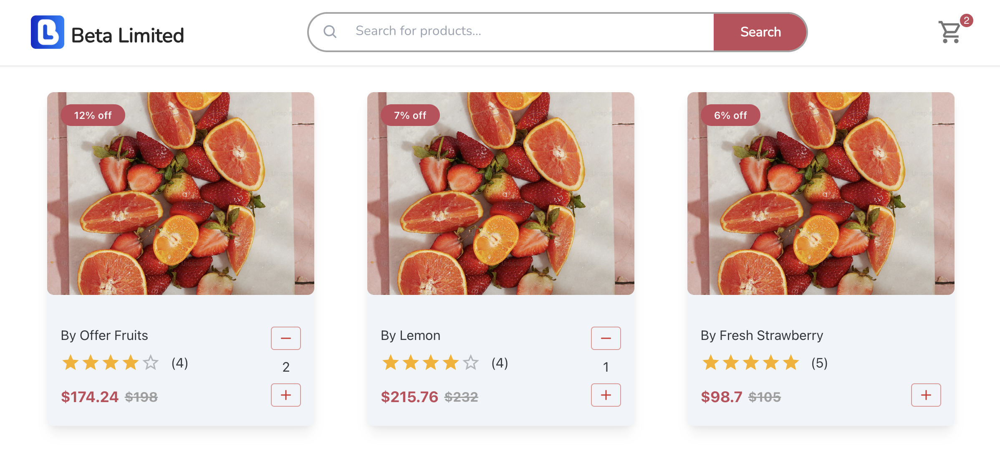
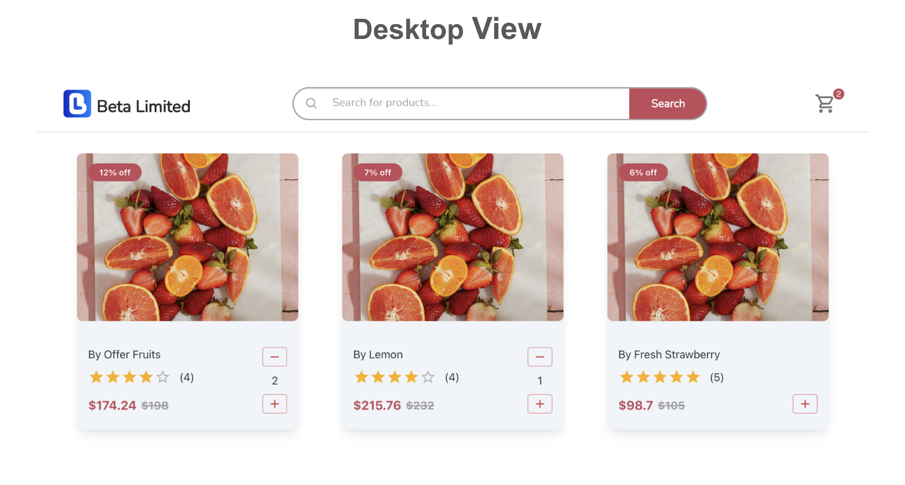
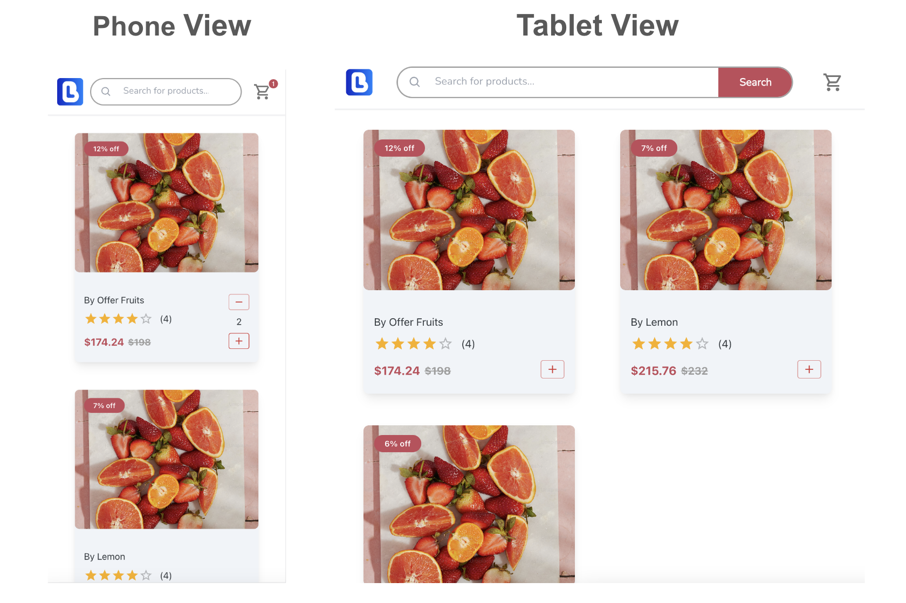

# E-Commerce Platform Product Page

## Project Overview and Task
This task is designed to develop a modern and user-friendly frontend for the BetaLimited e-commerce platform. Candidates are expected to effectively integrate Material-UI components and create a dynamic web application using React.js.

<p align="left" style="margin-top:1rem; border-radius:16px">
  
</p>

---
## Features
- **Product viewer:** Lists all products available and add to cart.
- **Search product:** Search for products by name.
- **Responsive Design:** Interface design using React.js and Material-UI libraries compatible with desktop, tablet, and mobile devices.
- **Cart:** Displays the number of items in the cart as well as the product details.
- **Context Management with Redux-Saga:** Manage the state of the application using Redux-Saga. 

## Tech stack
- `React:` A JavaScript library for building user interfaces.
- `Redux, Redux-Toolkit:` A predictable state container for JavaScript apps.
- `Redux-Saga:` A redux middleware library that is designed to make handling side effects in your redux app nice and simple.
- `Typescript:` Type safe version of Javascript.
- `Tailwind.css:` A utility-first CSS framework that enables rapid UI development with pre-defined styles and components. Flexbox and Grid structure has been used for creating the layout.
- `Material-UI:` React components for faster and easier web development.
- `Axios:` Promise based HTTP client for the browser and node.js.
- `React-icons`: Include popular icons in your React projects easily with react-icons.
- `Auto Animate:` Add motion to React apps with a single line of code.
- **Others:** Git, npm/Yarn, Prettier

## Live Site
Check out the [live site](https://react-product-card-material-ui.vercel.app/).

## Screenshots
The screenshots of the application are as follows. The application has a desktop mode which is shown below:

<p align="left" style="margin-top:1rem">
  
</p>

Project also has a mobile mode (covers smart phones and tablet size) which is shown below:

<p align="left" style="margin-top:1rem">
  
</p>

## Folder Structure
- `public`: Contains the static assets used in the application.
- `src`: Contains the source code of the application.
  - `components`: Contains reusable React components used throughout the application.
  - `App.js`: The main React component of the application.
  - `index.js`: The entry point of the application.
  - `redux`: Contains the Redux store, reducers, and actions.
- `screenshots`: Includes screenshots of the application.
- `tailwind.config.js`: The configuration file for the Tailwind CSS framework.
- `README.md`: The README file for the project.

## Running the Project Locally
### Prerequisites
- Node.js and npm

### Installation
1. **Change the directory:**
   ```sh
   cd react-product-card-material-ui
   ```
2. **Install Node.js dependencies:**
   ```sh
   npm install
   ```

3. **Start the React project:**
   ```sh
   npm start
   ```

## Contributing
Contributions to the project are welcome! Please follow the standard fork and pull request workflow.

## License
This project is licensed under the [MIT License](LICENSE.md).

## Contact
- Project Link: [https://github.com/mehmetakifakkus/react-product-card-material-ui](https://github.com/mehmetakifakkus/react-product-card-material-ui)
- Author - [mehmetakifakkus](https://mehmetakifakkus.github.io)

## References
- [Redux Toolkit](https://redux-toolkit.js.org/tutorials/typescript)
- [Redux Saga Beginner Tutorial](https://redux-saga.js.org/docs/introduction/BeginnerTutorial.html)
- [Redux Saga with Typescript](https://redux.js.org/usage/usage-with-typescript)
- [Redux Saga Documentation](https://redux-saga.js.org/docs/introduction/GettingStarted/)
- [Redux Saga in React Typescript](https://medium.com/edonec/implement-redux-saga-in-your-react-typescript-project-1d79c4a2d726)
- [Example app with Redux Saga](https://codesandbox.io/p/sandbox/redux-saga-stoic-euler-cjhgx-cjhgx?file=%2Fsrc%2Fredux%2Fducks%2Fcounter.js)
